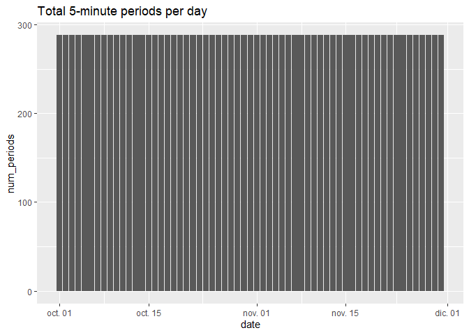
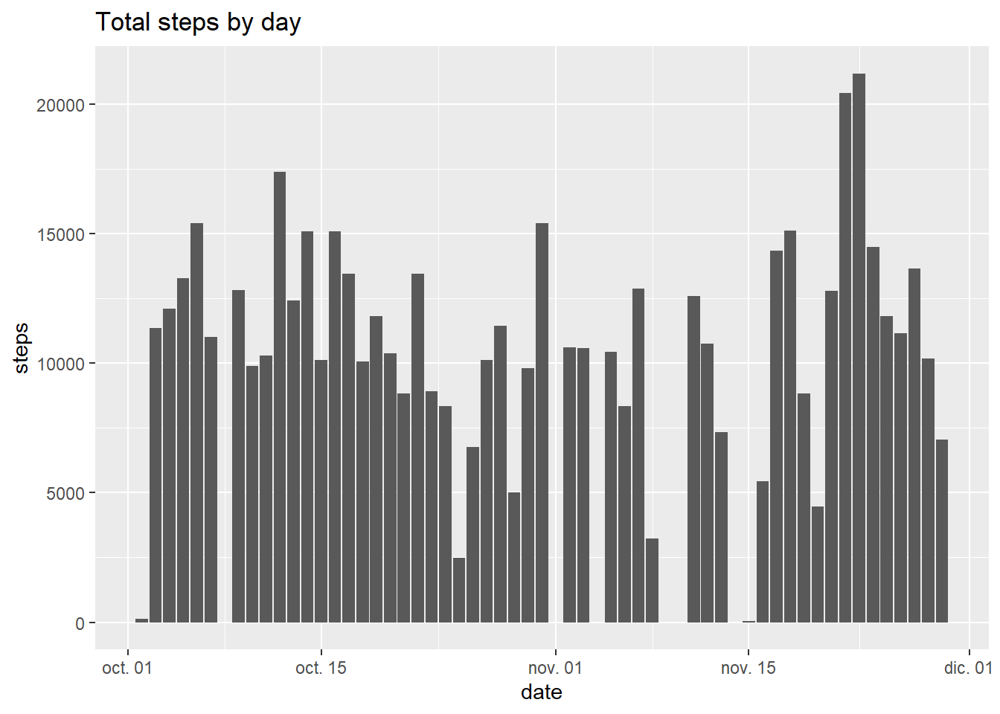
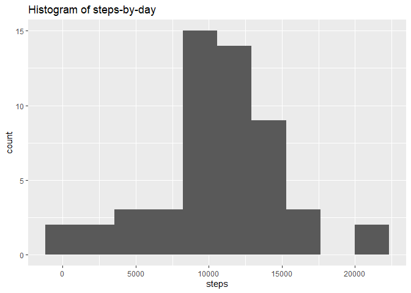
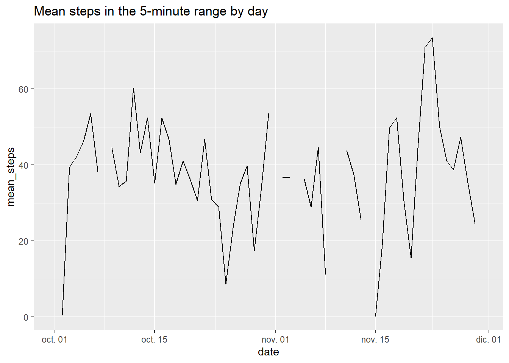
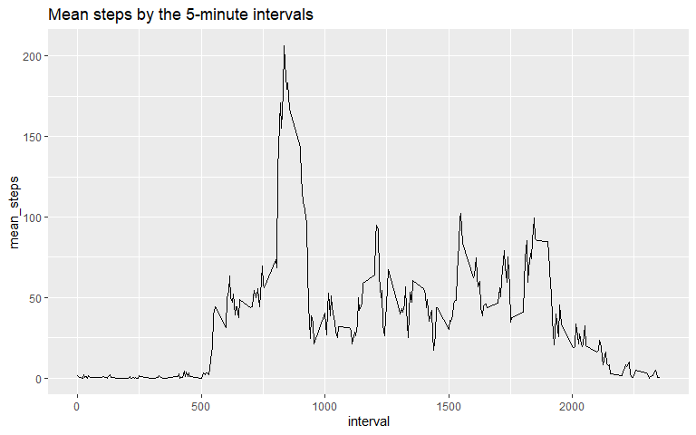
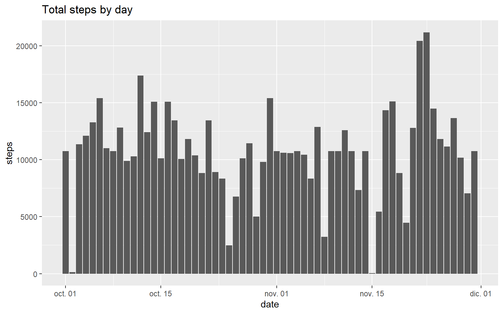
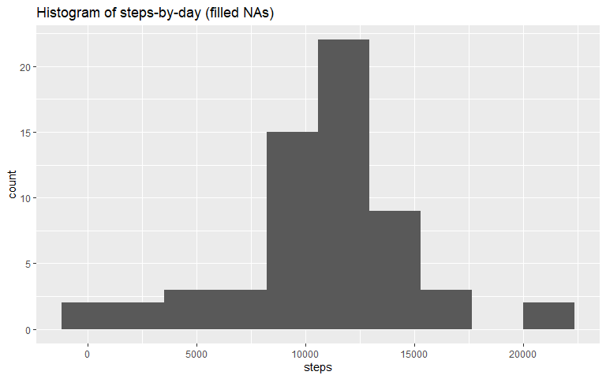
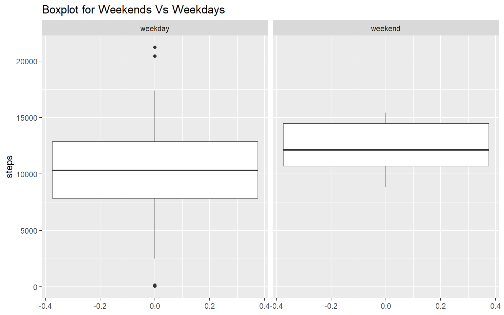

# Activity monitoring analysis
author: "Varenka Rico"
date: "2023-11-01"


## Abstract

The objective of this analysis is determine whether it seems to be a different walking activity through the day, as well as determine if activity changes during weekdays and weekends. There have been some data cleaning process to fill null values with average values. The results show there are different moments through the day that activity increases and decreases, and the number of steps during weekdays and weekends do have some difference.

## Analysis process

### Libraries required
library(tidyverse)  
library(lubridate)

### Getting information
In order to avoid downloading any file into the computer, a temp file is created. The information was downloaded on November 1st, 2023.


```r
temp <- tempfile()
download.file("https://d396qusza40orc.cloudfront.net/repdata%2Fdata%2Factivity.zip?raw=TRUE", 
              temp, mode = "wb")
raw_data <-read.csv(unzip(temp,"activity.csv"))
unlink(temp)
```

### Understanding the information
The table has 3 columns:  
  
**steps:** Number of steps taking in a 5-minute interval (missing values are coded as NA)  
**date:** The date on which the measurement was taken in YYYY-MM-DD format  
**interval:** Identifier for the 5-minute interval in which measurement was taken  

```r
head(raw_data)
```

```
##   steps       date interval
## 1    NA 2012-10-01        0
## 2    NA 2012-10-01        5
## 3    NA 2012-10-01       10
## 4    NA 2012-10-01       15
## 5    NA 2012-10-01       20
## 6    NA 2012-10-01       25
```

```r
summary(raw_data)
```

```
##      steps            date              interval     
##  Min.   :  0.00   Length:17568       Min.   :   0.0  
##  1st Qu.:  0.00   Class :character   1st Qu.: 588.8  
##  Median :  0.00   Mode  :character   Median :1177.5  
##  Mean   : 37.38                      Mean   :1177.5  
##  3rd Qu.: 12.00                      3rd Qu.:1766.2  
##  Max.   :806.00                      Max.   :2355.0  
##  NA's   :2304
```

#### Missing data - Identification
There are 2304 NAs in the data. All of them for the days 2012-10-01, 2012-10-08, 2012-11-01, 2012-11-04, 2012-11-09, 2012-11-10, 2012-11-14, 2012-11-30.

To make sure all the days have 288 5-minute periods, it is necessary to count the number of measurements done each day and plot it.


```r
df_5min_periods <- aggregate(raw_data$steps, by = list(ymd(raw_data$date)), FUN = length)
df_5min_periods <- setNames(df_5min_periods, c("date", "num_periods"))
```

```r
ggplot(data = df_5min_periods, aes(x=date, y=num_periods)) +
  geom_bar(stat="identity") +
  labs(title = "Total 5-minute periods per day")
```

<!-- -->

## Steps by day

To determine the total number of steps taken each day, it is necessary to sum the steps in each 5-minute period for each day first.


```r
df_by_day <- aggregate(raw_data$steps, by = list(ymd(raw_data$date)), FUN = sum)
df_by_day <- setNames(df_by_day, c("date", "steps"))
```

```r
ggplot(data = df_by_day, aes(x=date, y=steps)) +
  geom_bar(stat="identity") +
  labs(title = "Total steps by day")
```

```
## Warning: Removed 8 rows containing missing values (`position_stack()`).
```

<!-- -->

```r
ggplot(data = df_by_day, aes(x=steps)) +
  geom_histogram(bins = 10) +
  labs(title = "Histogram of steps-by-day")
```

```
## Warning: Removed 8 rows containing non-finite values (`stat_bin()`).
```

<!-- -->
  
The general stats per day are:


```r
summary(df_by_day)
```

```
##       date                steps      
##  Min.   :2012-10-01   Min.   :   41  
##  1st Qu.:2012-10-16   1st Qu.: 8841  
##  Median :2012-10-31   Median :10765  
##  Mean   :2012-10-31   Mean   :10766  
##  3rd Qu.:2012-11-15   3rd Qu.:13294  
##  Max.   :2012-11-30   Max.   :21194  
##                       NA's   :8
```

The **mean** number of steps was 10766 steps.  
The **median** number of steps was 10765 steps.

## Review of the 5-minute interval information

```r
df_avg_by_day <- aggregate(raw_data$steps, by = list(ymd(raw_data$date)), FUN = mean)
df_avg_by_day <- setNames(df_avg_by_day, c("date", "mean_steps"))
```
For the 5-minute range per day average

```r
ggplot(data = df_avg_by_day, aes(x=date, y=mean_steps)) +
  geom_line () +
  labs(title = "Mean steps in the 5-minute range by day")
```

```
## Warning: Removed 2 rows containing missing values (`geom_line()`).
```

<!-- -->
  
As it is natural, there are 5-minute intervals with higher and lower activity through the day.


  
The highest 5-minute intervals are around 8am with some peaks at 15hrs, 13hrs and 18hrs. The initial part of the day, before 5am, the number of steps is near to zero, and after 19hrs it starts to decrease till the end of the day. This activity registration makes sense of what could be expected.


```r
ggplot(data = df_avg_by_interval, aes(x=interval, y=mean_steps)) +
  geom_line () +
  labs(title = "Mean steps by the 5-minute intervals")
```

<!-- -->

### Filling NA's with average interval steps
NA's values will be filled with the average of each 5-minute interval will be added in order to avoid impacting the overall average registered.


```r
df_filled_na <- raw_data

for (i in 1:nrow(df_avg_by_interval)) {
  interval <- df_avg_by_interval$interval[i]
  average_value <- df_avg_by_interval$mean_steps[i]
  
  df_filled_na$steps[is.na(df_filled_na$steps) == TRUE 
                     & df_filled_na$interval == interval] <- average_value
  
}
```

```r
df_filled_na_by_day <- aggregate(df_filled_na$steps, by = list(ymd(df_filled_na$date)), FUN = sum)
df_filled_na_by_day <- setNames(df_filled_na_by_day, c("date", "steps"))
```

```r
ggplot(data = df_filled_na_by_day, aes(x=date, y=steps)) +
  geom_bar(stat="identity") +
  labs(title = "Total steps by day")
```

<!-- -->

To make sure the filling of missing values did not affect the general behavior previously reviewed, here are the General Stats and the Histogram for the completed table.


```r
ggplot(data = df_filled_na_by_day, aes(x=steps)) +
  geom_histogram(bins = 10) +
  labs(title = "Histogram of steps-by-day (filled NAs)")
```

<!-- -->
  
The general stats per day are:


```r
summary(df_filled_na_by_day)
```

```
##       date                steps      
##  Min.   :2012-10-01   Min.   :   41  
##  1st Qu.:2012-10-16   1st Qu.: 9819  
##  Median :2012-10-31   Median :10766  
##  Mean   :2012-10-31   Mean   :10766  
##  3rd Qu.:2012-11-15   3rd Qu.:12811  
##  Max.   :2012-11-30   Max.   :21194
```

  
The **mean** number of steps was 10766 steps.  
The **median** number of steps was 10765 steps. 
The **mean** and **median** remained almost equal, showing this method of filling out missing values worked as expected.  
And as it was expected, the 1st Quartile and 3rd Quartile did have some change due to the add of values around in the mean range.  

### Weekdays Vs Weekends

  
During the weekdays it seems to be higher variance and the mean is 10177. For weekends, the mean is 12407.


```r
ggplot(data = df_day_type, aes(y=steps)) +
  geom_boxplot() +
  facet_wrap(~Day) +
  labs(title = "Boxplot for Weekends Vs Weekdays")
```

```
## Warning: Removed 8 rows containing non-finite values (`stat_boxplot()`).
```

<!-- -->
